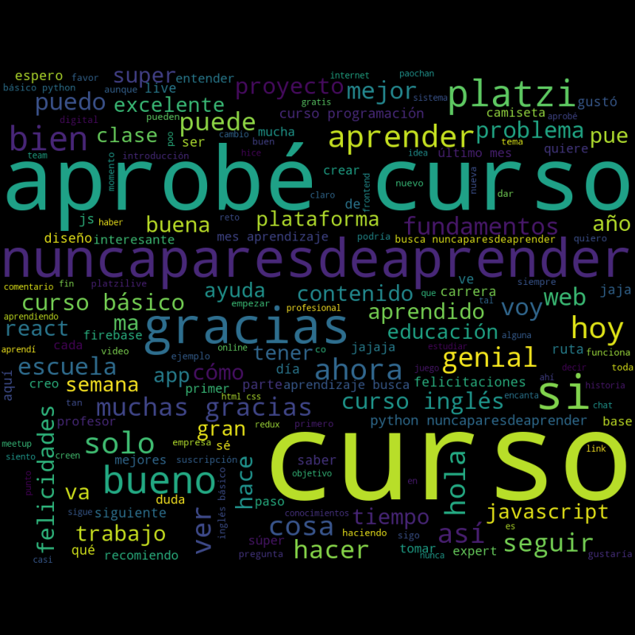

# TWITTER WORDCLOUD

Este es un proyecto inspirado en la charla de [@silvercorp](https://www.twitter.com/silvercorp) del meetup de la Escuela de Data Science de [Platzi](https://platzi.com/) del 3 de agosto de 2020.

El objetivo es extraer informació de una cuenta o hashtag de twitter para crear una nube de palabras como esta:



___

Para ejecutar el archivo recuerda instalar un ambiente virtual:

```
python -m venv venv

source venv/Script/activate

```

e instalar las librerias necesarias con el archivo requirements.txt

```
pip install -r requirements.txt

```